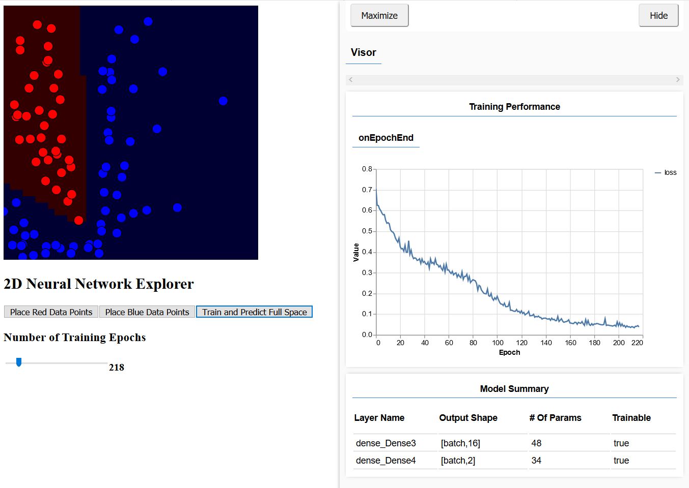

## A 2D Neural Network Explorer in Javascript using p5.js and ml5.js
A javascript implementation of my 2D Neural Network explorer
### Try it out [here](https://cmcollander.github.io/NeuralNetworkExplorerJS/)!

Due to a recent hand injury, I've had to learn how to comfortably code with one hand. I needed a fun project to get me back to work and this is something I've always wanted to write!

With this script, you can use the left mouse button to place data points in the window, using the buttons below to choose between red points and blue points. After you have *at least* a few data points, you can press enter to train the neural network. This will take at least a few seconds, based on your model. The console will display the trained accuracy and will then run the model on the background, predicting what color that space should be. This background inference allows the user to visualize the boundary between the data points.

In a future update, I will be adding multiple checkboxes, sliders, and selectors to allow the user to change the NN model in detail. But after this future update, here is some stuff I want you to try! 

Mess around with the model and see how changing the hyperparameters changes your boundary in different configurations of data points.

Here are some interesting questions to ask!
* Can you recreate the XOR problem with a single perceptron?
* What is the smallest model you can create that can correctly predict a cluster of red data points surrounded by a ring of blue?
  * *This is actually really cool when you realize how it does this! Reach out to me if you want an explanation!*
* How do various optimizers and hidden layer activations affect the results?
* Can you create a model so complex that it will overfit a purely random arrangement of points to 100% accuracy?

### Authors

* Chris Collander &lt;cmcollander@gmail.com&gt;

### License and Copyright

This project is licensed under GNU GPLv3 - see the [LICENSE.md](LICENSE.md) file for details

Copyright 2020, Chris Collander
